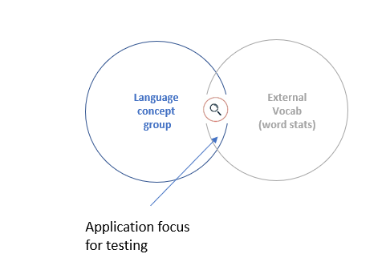

# paice_method
This jupyter notebook extends the concept of Paice method of evaluating stemmers for search application. 
This aproach introduces a weight for comparing overstemming / understermming scores. Additional weight is calculated based on 
word stats from application vocabulary. 

This approach has the advantage with a metric for the quality of a stemmer sensitive to application for search.  
The second advantage of proposed method is that the effects of words in large concept groups(for example with all verbal forms)
do not dominate the results. The weight of each word is equal. 

## Contents

- stemmers.py: Different stemming classes that extends base Stemmer.
- solr_client: client to solr with basic API for analysis.

##Example

